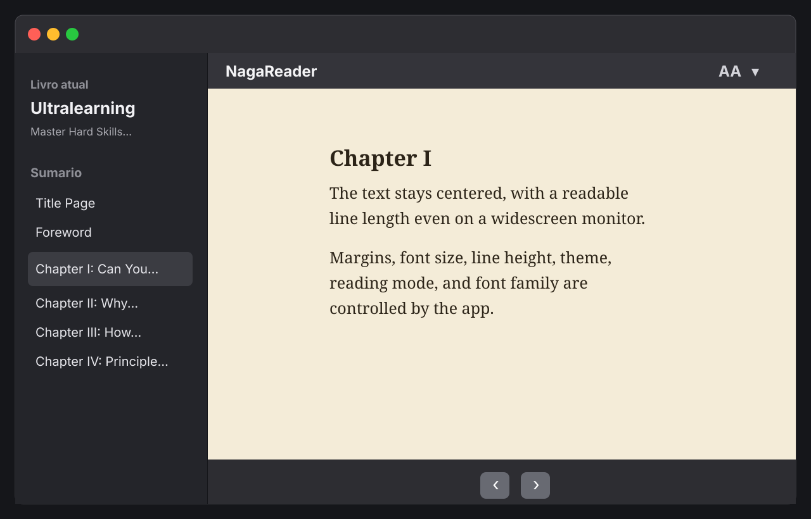
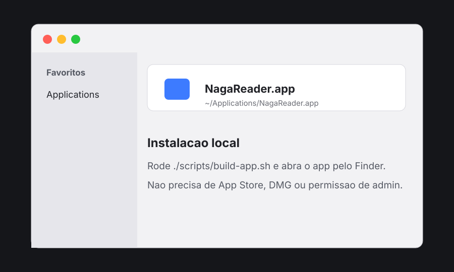
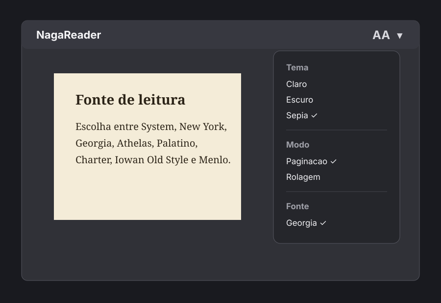

# NagaReader

NagaReader e um leitor local de EPUB para macOS, feito para leitura confortavel em monitores widescreen. A ideia central e manter o texto em uma coluna centralizada, com largura, margens, fonte, tema e modo de leitura configuraveis.



## O Que Ele Faz

- Abre arquivos EPUB locais.
- Copia o EPUB para o armazenamento local do app.
- Mostra sumario e capitulos.
- Renderiza o texto em uma coluna centralizada.
- Permite ajustar largura da coluna, margem, tamanho da fonte, altura da linha, tema, modo de leitura e familia da fonte.
- Suporta paginacao e rolagem continua.
- Salva a posicao de leitura por livro.
- Reabre livros recentes.
- Pode ser instalado como `NagaReader.app` em `~/Applications`.

## Instalar Como App

Rode:

```sh
cd "/Users/yuji/Documents/epub reader"
./scripts/build-app.sh
```

O script compila o pacote Swift, cria `.build/NagaReader.app` e instala uma copia em:

```text
~/Applications/NagaReader.app
```

Depois disso, abra pelo Finder:



Este fluxo e local e pessoal. Ele nao assina, nao notariza, nao publica na App Store e nao gera `.dmg` ou `.pkg`.

## Usar

1. Abra `~/Applications/NagaReader.app`.
2. Clique em **Abrir EPUB**.
3. Escolha um arquivo `.epub`.
4. Use o sumario na lateral para trocar de capitulo.
5. Use os botoes inferiores, o teclado ou o modo de rolagem para navegar.

## Aparencia

Abra o menu **AA** no canto superior direito.



Configuracoes disponiveis:

- **Tema:** claro, escuro ou sepia.
- **Modo:** paginacao ou rolagem.
- **Fonte:** System, New York, Georgia, Athelas, Palatino, Charter, Iowan Old Style ou Menlo.
- **Largura:** largura maxima da coluna de leitura.
- **Margem:** espaco ao redor do texto.
- **Fonte:** tamanho do texto.
- **Linha:** altura da linha.

As configuracoes sao globais e ficam salvas entre execucoes do app.

## Teclado

No modo paginacao:

- `→`, `↓`, `Space`, `Page Down`: avancar.
- `←`, `↑`, `Shift+Space`, `Page Up`: voltar.

No modo rolagem:

- `↓`, `Space`, `Page Down`: rolar para baixo.
- `↑`, `Shift+Space`, `Page Up`: rolar para cima.

Ao chegar no fim de um capitulo, avancar abre o proximo capitulo. Ao chegar no inicio, voltar abre o capitulo anterior.

## Desenvolvimento

Build de desenvolvimento:

```sh
CLANG_MODULE_CACHE_PATH=/tmp/naga-clang-cache swift build
```

Build e instalacao local:

```sh
./scripts/build-app.sh
```

Rodar o executavel diretamente:

```sh
.build/debug/NagaReader
```

## Testes

A suite esta em `Tests/NagaReaderCoreTests`.

Neste ambiente atual, `swift test` pode falhar antes de executar os testes por um problema de instalacao das Command Line Tools/XCTest:

```text
error: XCTest not available
```

Quando o XCTest estiver disponivel no macOS, rode:

```sh
swift test
```

## Escopo Atual

Suportado:

- EPUB textual/reflowable.
- Imagens simples dentro de capitulos.
- Uso local e pessoal no macOS.

Fora de escopo por enquanto:

- PDF.
- EPUB fixed-layout.
- Quadrinhos/manga.
- Highlights e anotacoes.
- Busca no livro inteiro.
- Sincronizacao em nuvem.
- App Store, assinatura, notarizacao e instalador.

## Solucao De Problemas

Se uma feature nova nao aparecer no app aberto pelo Finder, reinstale o bundle:

```sh
cd "/Users/yuji/Documents/epub reader"
./scripts/build-app.sh
```

Depois feche e abra novamente:

```text
~/Applications/NagaReader.app
```
